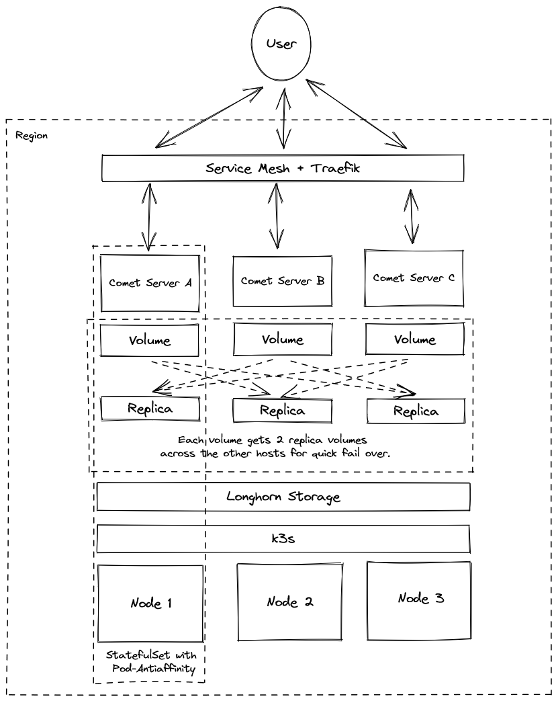

# Comet Server Cluster (Experimental)

Create a three-node Comet Server region in Hetzner Cloud. Built using Hetzner's k3s terraform provider - [kube-hetzner](https://github.com/kube-hetzner/terraform-hcloud-kube-hetzner).

**How it works:**

1. Use [packer](https://www.packer.io/) to create a Hetzner snapshot containing the base k3s node image.
2. Use [terraform](https://www.terraform.io/) to create a configure a three-node k3s cluster using Hetzner Cloud VMs.
3. Use a custom [helm](https://helm.sh/) chart to deploy [ghcr.io/cometbackup/comet-server](https://github.com/cometbackup/comet-server-docker/pkgs/container/comet-server) to each node (using StatefulSet with pod-antiaffinity to restrict one server per node).
4. Use [external-dns](https://github.com/kubernetes-sigs/external-dns) to update Route53 records.
5. Using pre-configured `account.cometbackup.com` credentials, generate a Comet Server serial number.

**Overview:**




**Requirements:**

Please ensure that you have the `hcloud` CLI, `terraform`, `packer`, `kubectl`, and `helm` installed before continuing.

**Usage:**

```bash
export HCLOUD_TOKEN="<your-hcloud-token>"
export TF_VAR_hcloud_token=$HCLOUD_TOKEN

# Build the node images -
# This only needs to be run once to create the initial images
packer init packer/hcloud-microos-snapshots.pkr.hcl
packer build packer/hcloud-microos-snapshots.pkr.hcl

# Bring up the cluster
terraform init --upgrade
terraform apply --auto-approve

# You should now have a kubeconfig file in the project root -
# Export this, and test the cluster connection
export KUBECONFIG=/k3s_kubeconfig.yaml
kubectl get nodes -o wide

# Secrets
kubectl create secret generic comet-account-creds --namespace default --from-literal email=<account@email.com> --from-literal password=<account-password>
kubectl create secret generic r53-creds --namespace default --from-file ~/.aws/credentials

# Deploy the chart
helm install cometd ./chart
```