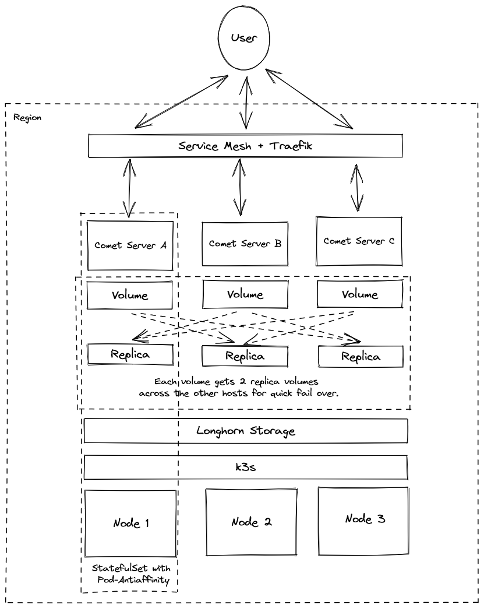

# Comet Server Helm Chart

Create a three-node Comet Server region.

**Overview:**



**Requirements:**

Please ensure that you have `kubectl` and `helm` installed before continuing.

**Usage:**

```bash
# Ensure that your cluster is working
kubectl get nodes -o wide

# Secrets
kubectl create secret generic comet-account-creds --namespace default --from-literal email=<account@email.com> --from-literal password=<account-password>
kubectl create secret generic r53-creds --namespace default --from-literal access_key_id=<aws-access-key> --from-literal secret_access_key=<aws-secret-key>

# Deploy the chart
helm install cometd ./
```